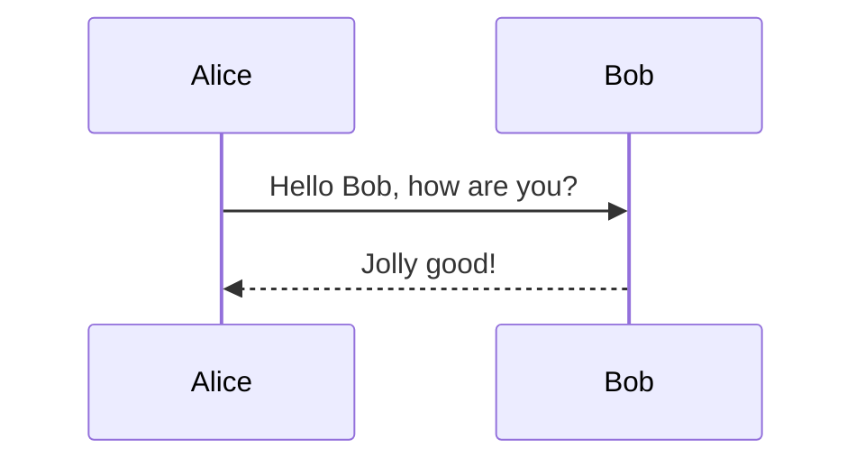
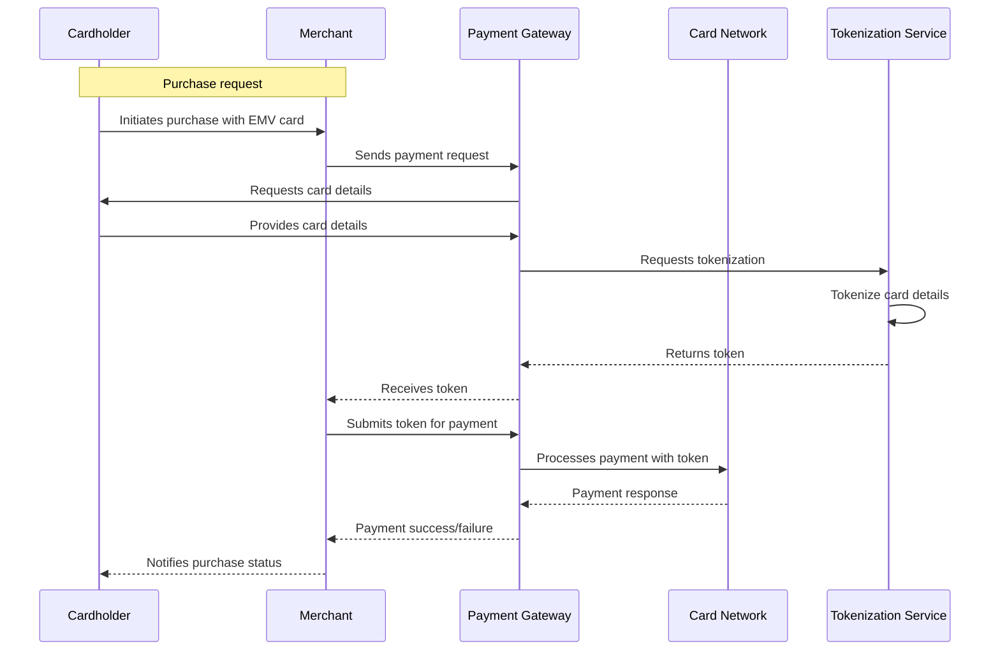
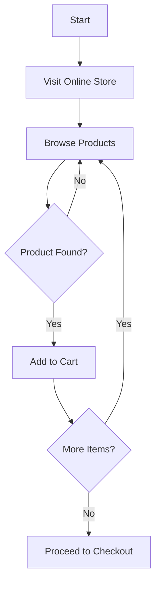
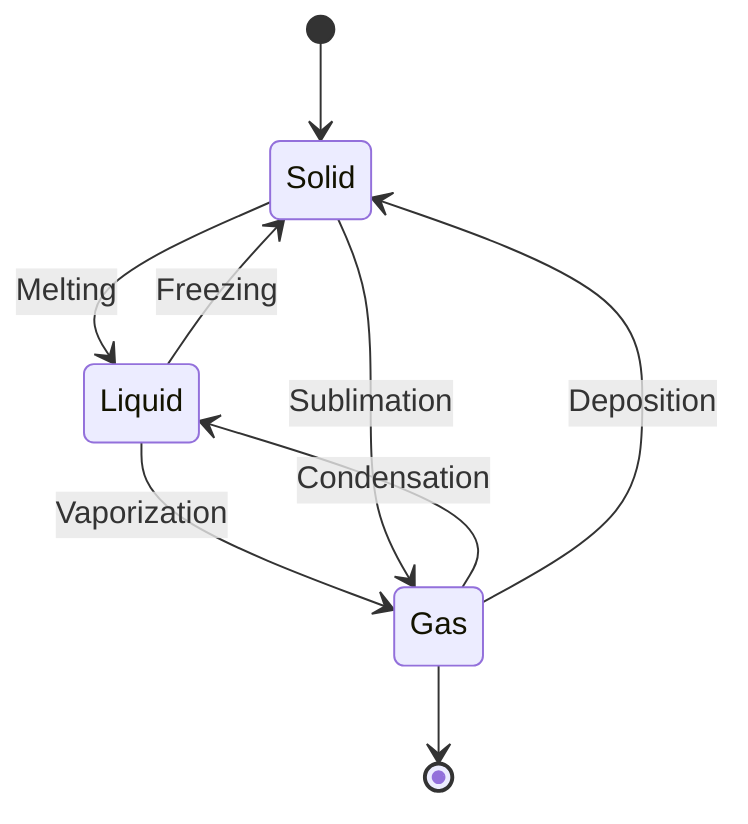

# Mermaid
`Diagram As Code`

---

## Introduction

> Mermaid is a text/code based diagramming tool for easy creation of various diagrams and visualizations, using simple text-based syntax.

---

## Example




---

## Universal Selling Proposition
- Simple Text based syntax.
- Version control friendly.
- Wide range of Diagram Types.
- Offers extensive styling and configuration options.
- Integration with Markdown, Confluence, and other tools.


---

## Supported Tooling
- Live Editor (https://mermaid.live/)
- Draw.io
- Markdown Editors
- Confluence
- VS Code Extension
- GitHub Integration
- GitLab Integration
- Jupyter Notebooks

---

<style scoped>
h1 {
    text-align:center;
    margin-top: 20%;
}
</style>

# Example Diagrams

---
#### Sequence Diagram




---

## Flowchart



---
## State Diagram




---

## Example Diagrams for Product Managers and Business Analysts

--- 

## Product Roadmap


---
## User Journey Maps


---
## Decision Trees


---
## Business Process Diagrams 


---


## Timelines 


---

## Example Diagrams for Developers and Architects

--- 

## System Architecture Diagrams


--- 

## Database Schema Visualization


--- 

## API Interaction Diagrams


--- 

## Git Graph


---


## Demo
### `Mermaid + Draw.io`

---
Copy the snippet
`Draw.io -> Arrange -> Insert -> Advanced -> Mermaid`


---
## Demo
### `Mermaid + Chat GPT`

---
### Prompt

```
I'd like you to generate a sequence diagram for the following payment transaction workflow:

Actors: Cardholder, Merchant, Payment Gateway, Card Network, Tokenization Service

Workflow:
1. The Cardholder initiates a payment transaction with the Merchant.
2. The Merchant sends the card data (e.g., card number, expiry date, CVV) to the Payment Gateway.
3. The Payment Gateway initiates the tokenization process by sending a request to the Tokenization Service.
4. The Tokenization Service generates a unique token for the provided card data and sends it back to the Payment Gateway.
5. The Payment Gateway receives the token from the Tokenization Service and forwards it to the Merchant.
6. The Merchant processes the payment using the tokenized card data (without storing the actual card details).
7. At a later point, when needed (e.g., for refunds or disputes), the Payment Gateway requests the de-tokenization of the payment data from the Tokenization Service.
8. The Tokenization Service retrieves the original card data associated with the token and sends it back to the Payment Gateway.
9. The Payment Gateway receives the de-tokenized card data and completes the payment transaction with the Merchant using the original card data.

Additional Notes:
* You can simplify the diagram by omitting details like specific message formats or error handling.
* Generate the diagram in mermaid syntax. 
* Add short aliases for the Actors.
```
---

## Thank You!

